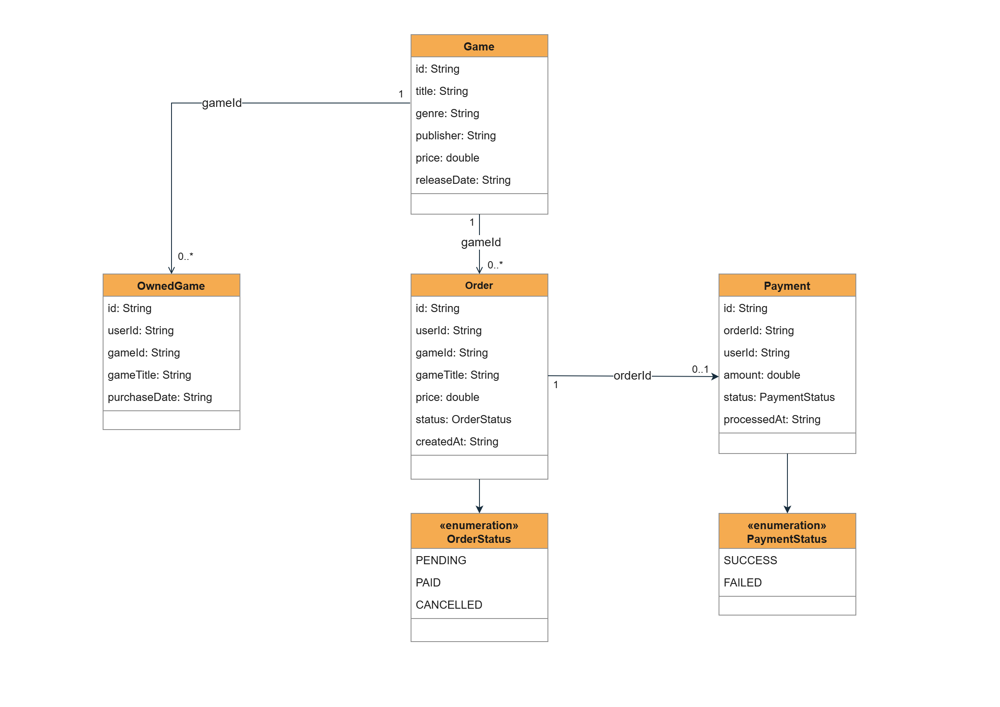
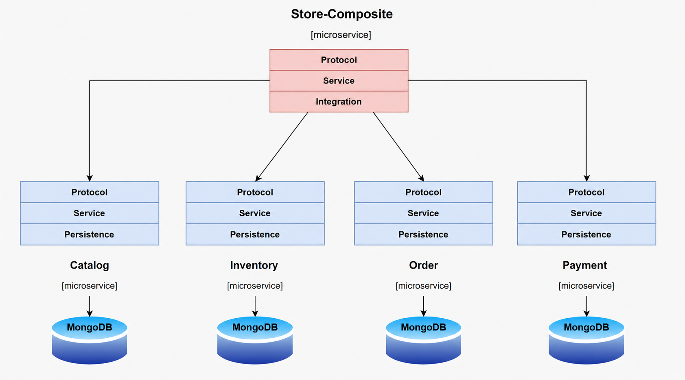
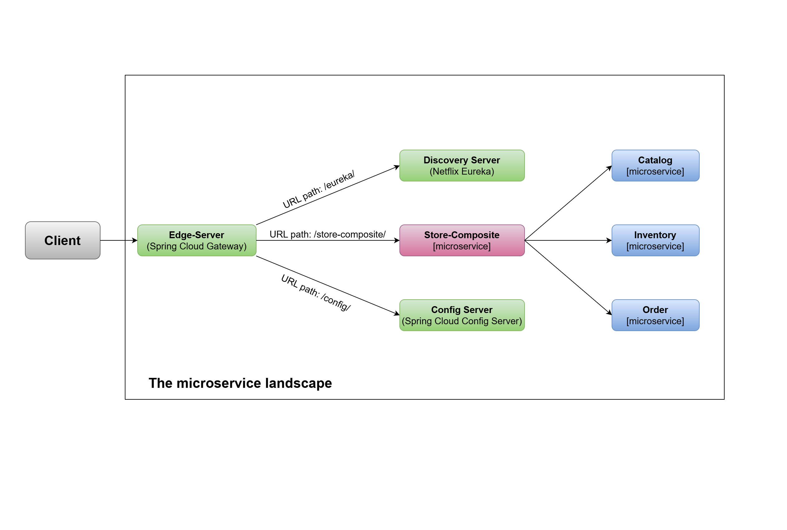

# Game Marketplace — Microservices

Game Marketplace is a microservice-based online marketplace for video games.

It is implemented as a microservice architecture using `Spring Boot` and `Spring Cloud`. Business logic is distributed across five microservices. The `catalog`, `inventory`, `order`, and `payment` microservices represent the core services, while `store-composite` integrates the four core microservices.

## Business Logic

Game Marketplace simulates a digital storefront for video games.

A user can:

- **browse the game catalog** — search and view game details such as genre, publisher, price, and release date,
- **purchase a game** — place an order for a game they don't already own,
- **view their library** — see the list of games they currently own.

Each of these user-facing actions is handled by a different combination of microservices:

- Browsing the catalog is served entirely by `catalog-service`.
- Purchasing a game is a multi-step process: `store-composite-service` creates an order through `order-service`, which is then processed asynchronously — `payment-service` charges the user, and only once the payment succeeds does `inventory-service` add the game to the user's library.
- Viewing the library is served by `inventory-service`.

The system was built as a solution to the exam assignment for the Distributed Information Systems course, which requires a Spring Cloud-based microservice system with at least 5 business-logic microservices, containerized components, both synchronous and asynchronous communication, automated tests, and a defined build/test/deploy pipeline.

## Persistence

Data persistence is enabled using `Spring Data`.

In this project, Spring Data is used with one type of NoSQL database: `MongoDB`.

Each core microservice has its own logical MongoDB database, following the database-per-service principle:
- catalog-service → catalog-db
- inventory-service → inventory-db
- order-service → order-db
- payment-service → payment-db

The image below shows the class diagram used in the project.



## Architecture and Communication

All core microservices contain a persistence layer through which communication with their corresponding databases is performed. The composite microservice contains an integration component that combines functionality from the core microservices.



Synchronous microservice communication is provided:

- for `READ` operations from the `store-composite` microservice toward `catalog-service` and `inventory-service`, used to retrieve game details and the user's game library, and
- for the `CREATE` operation, where `store-composite` forwards order creation requests to `order-service`.

Asynchronous communication takes place during order processing.

The messaging system used is `RabbitMQ`, integrated through `Spring Cloud Stream`.

The order-processing flow is:

1. `order-service` creates an order with the status `PENDING` and emits an `OrderCreatedEvent`.
2. `payment-service` receives the event, processes the payment, and emits a `PaymentProcessedEvent` with the status `SUCCESS` or `FAILED`.
3. `inventory-service` receives the `PaymentProcessedEvent`. If the payment was successful, the game is added to the user's library.

## Microservice Landscape



Spring Cloud is used to implement the following design patterns:

- Service discovery
- Edge server
- Centralized configuration

| Design Pattern            | Spring Cloud Component                       | Description                                                                                                                                                                                 |
| ------------------------- | -------------------------------------------- | ------------------------------------------------------------------------------------------------------------------------------------------------------------------------------------------- |
| Service discovery         | Netflix Eureka and Spring Cloud LoadBalancer | The Service Discovery service keeps track of currently available microservices and the IP addresses of their instances.                                                                     |
| Edge server               | Spring Cloud Gateway                         | The edge server is used to secure the microservice landscape by hiding private services from external access and protecting public services.                                                |
| Centralized configuration | Spring Cloud Config Server                   | Centralized configuration provides centralized management of configuration files. |

## Testing

- **Unit tests** — cover the service layer of all 5 business-logic microservices (`catalog`, `inventory`, `order`, `payment`, and `store-composite`) using Mockito to isolate the service layer from the database.
- **Integration tests** — `catalog-service` and `order-service` contain integration tests that use Testcontainers to start a real MongoDB instance inside an isolated container.

## Pipeline

The project contains a clearly defined build, test, and deployment process. GitHub Actions is used for continuous integration, while Docker Compose is used to build and run the complete microservice landscape.

### Build the Project

Build all modules without running tests:

```bash
./gradlew build -x test
```

### Run Tests

Run unit and integration tests for all business-logic microservices:

```bash
./gradlew :catalog-service:test :inventory-service:test :order-service:test :payment-service:test :store-composite-service:test
```

### Start the Microservice Landscape (Development)

Build and start the complete microservice landscape, including all microservices, MongoDB, RabbitMQ, Eureka, Config Server, and API Gateway:

```bash
docker-compose up -d --build
```

Once the microservice landscape is running, the system can be verified by checking that all services are registered in Eureka at:

`http://localhost:8761`

A request can also be sent through the API Gateway:

```bash
curl http://localhost:8080/api/games
```

### Shut Down the Microservice Landscape

```bash
docker-compose down
```

## Continuous Integration

Continuous integration is configured using **GitHub Actions**.

The workflow is defined in:

`.github/workflows/pipeline.yml`

It is triggered on every push and pull request to the `master` branch.

The pipeline consists of two jobs:

1. **build-and-test** — builds all modules and runs unit and integration tests for the business-logic microservices.
2. **docker-build** — builds a Docker image for each of the 5 microservices. This job runs only if the previous job completes successfully.
